# Maven Market Project - Analyzing Data of a Grocery Chain Firm
## Introduction


This Project Case is part of the Microsoft Power BI Desktop for Business Intelligence Course on [Udemy](https://www.udemy.com/course/microsoft-power-bi-up-running-with-power-bi-desktop/) online platform by Maven Analytics. In this case, I worked with data from **Maven Market**, a multi-national grocery chain with locations in **Canada, Mexico** and the **United States**. I worked through the entire business intelligence workflow: **connecting and shaping the data, building a relational model, adding calculated fields, and designing an interactive report**.

## Problem Questions

## Datasets
There are 7 Datasets used in this project, i.e.:

**1. Customer Table Dataset (MavenMarket_Calendar.csv)**

| **Field Name** | **Data Type** |
| ------ | ------ |
| customer_id | Whole Number|
| customer_acct_num | Text |
| first_name | Text |
| last_name | Text |
| customer_address | Text |
| customer_city | Text |
| customer_state_province | Text |
| customer_postal_code | Text |
| customer_country | Text |
| birthdate | Date |
| marital_status | Text |
| yearly_income | Text |
| gender | Text |
| total_children | Whole Number |
| num_children_at_home | Whole Number |
| education | Text |
| acct_open_date | Date |
| member_card | Text |
| occupation | Text |
| homeowner | Text |
| full_name | Text |
| birth_year | Text |
| has_children | Y/N |

**2. Products Table Dataset (MavenMarket_Products.csv)**

| **Field Name** | **Data Type** |
| ------ | ------ |
| product_id | Whole Number |
| product_brand | Text |
| product_name | Text |
| product_sku | Text |
| product_retail_price | Decimal Number |
| product_cost | Decimal Number |
| product_weight | Decimal Number |
| recyclable | Decimal Number |
| low_fat | Decimal Number |
| discount_price | Fixed Decimal Number (Currency) |

**3. Calendar Table Dataset (MavenMarket_Calendar.csv)**

| **Field Name** | **Data Type** |
| ------ | ------ |
| date | Date |
| Start of Week | Date |
| Name of Day | Text |
| Start of Month | Date |
| Name of Month | Text |
| Quarter | Whole Number |
| Year | Whole Number |

**4. Regions Table Dataset (MavenMarket_Regions.csv)**

| **Field Name** | **Data Type** |
| ------ | ------ |
| region_id | Whole Number |
| sales_district | Text |
| sales_region | Text |

**5. Stores Table Dataset (MavenMarket_Stores.csv)**

| **Field Name** | **Data Type** |
| ------ | ------ |
| store_id | Whole Number |
| region_id | Whole Number |
| store_type | Text |
| store_name | Text |
| store_street_address | Text |
| store_city | Text |
| store_state | Text |
| store_country | Text |
| store_phone | Text |
| first_opened_date | Date |
| last_remodel_date | Date |
| total_sqft | Whole Number |
| grocery_sqft | Whole Number |
| full_address | Text |
| area_code | Text |

**6. Transaction Table Dataset (MavenMarket_Transactions_1997 & MavenMarket_Transactions_1998.csv)**

| **Field Name** | **Data Type** |
| ------ | ------ |
| transaction_date | Date |
| stock_date | Date |
| product_id | Whole Number |
| customer_id | Whole Number |
| store_id | Whole Number |

**7. Return Table Dataset (MavenMarket_Returns_1997-1998.csv)**

| **Field Name** | **Data Type** |
| ------ | ------ |
|return_date | Date |
| product_id | Whole Number |
| store_id | Whole Number |
| quantity | Whole Number |


## Connecting and Shaping the Data

There are several steps in this phase in order to connect and shape the Data used in this case.

**1. Update Power BI options and settings by:** 

- Deselecting the "Autodetect new relationships after data is loaded" option in the Data Load tab
- Making sure that Locale for import is set to "English (United States)" in the Regional Settings tab

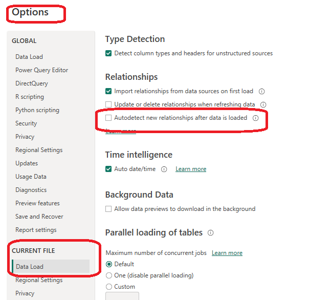

**2. Connect to the MavenMarket_Customers csv file by:**

- Naming the table "Customers", and making sure that headers have been promoted
- Confirming that data types are accurate (Note: "customer_id" should be whole numbers, and both "customer_acct_num" and "customer_postal_code" should be text)
- Adding a new column named "full_name" to merge the the "first_name" and "last_name" columns, separated by a space
- Creating a new column named "birth_year" to extract the year from the "birthdate" column, and format as text
- Creating a conditional column named "has_children" which equals "N" if "total_children" = 0, otherwise "Y"

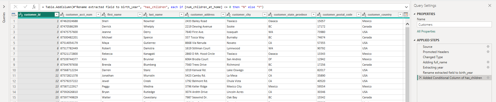

**3. Connect to the MavenMarket_Products csv file by:**

- Naming the table "Products" and making sure that headers have been promoted
- Confirming that data types are accurate (Note: "product_id" should be whole numbers, "product_sku" should be text), "product_retail_price" and "product_cost" should be decimal numbers)
- Using the statistics tools to return the number of distinct product brands, followed by distinct product names and conducting Spot check to see **111 brands and 1,560 product names**
- Adding a calculated column named "discount_price", equal to 90% of the original retail price and formating as a fixed decimal number, and then use the rounding tool to round to 2 digits
- Selecting "product_brand" and use the Group By option to calculate the average retail price by brand, and name the new column "Avg Retail Price". Conducting Spot check to see an average retail price of $2.18 for Washington products, and $2.21 for Green Ribbon
- Deleting the last applied step to return the table to its pre-grouped state
- Replacing "null" values with zeros in both the "recyclable" and "low-fat" columns

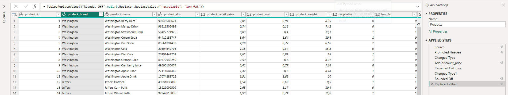

**4. Connect to the MavenMarket_Stores csv file by:**

- Naming the table "Stores" and making sure that headers have been promoted
- Confirming that data types are accurate (Note: "store_id" and "region_id" should be whole numbers)
- Adding a calculated column named "full_address", by merging "store_city", "store_state", and "store_country", separated by a comma and space (hint: use a custom separator)
- Adding a calculated column named "area_code", by extracting the characters before the dash ("-") in the "store_phone" field

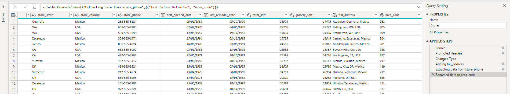

**5. Connect to the MavenMarket_Regions csv file by:**

- Naming the table "Regions" and making sure that headers have been promoted
- Confirming that data types are accurate (Note: "region_id" should be whole numbers)

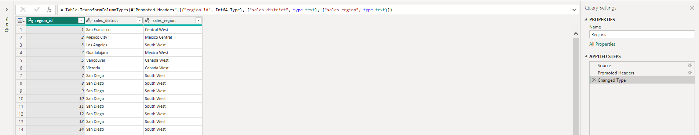

**6. Connect to the MavenMarket_Calendar csv file by:**

- Naming the table "Calendar" and making sure that headers have been promoted
- Using the date tools in the query editor to add the following columns:
    > Start of Week (starting Sunday, Name of Day, Start of Month, Name of Month, Quarter of Year, Year

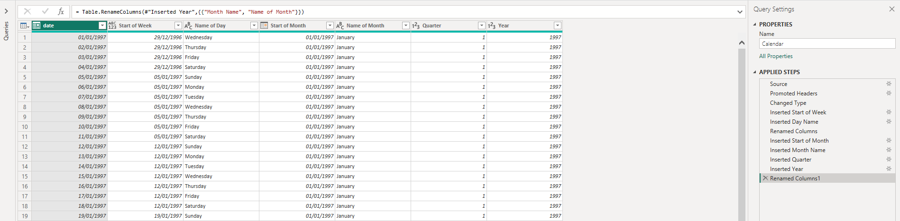

**7. Connect to the MavenMarket_Returns csv file by:**

- Naming the table "Return_Data" and making sure that headers have been promoted
- Confirming that data types are accurate (all ID columns and quantity should be whole numbers)

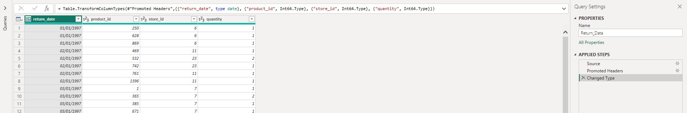

**8. Add a new folder on your desktop (or in your documents) named "MavenMarket Transactions", containing both the MavenMarket_Transactions_1997 and MavenMarket_Transactions_1998 csv files by:**

- Connecting to the folder path, and choosing "Edit" (vs. Combine and Edit)
- Clicking the "Content" column header (double arrow icon) to combine the files, then removing the "Source.Name" column
- Naming the table "Transaction_Data", and confirming that headers have been promoted
- Confirming that data types are accurate (all ID columns and quantity should be whole numbers) and conducting Spot check to see data from 1/1/1997 through 12/30/1998 in the "transaction_date" column

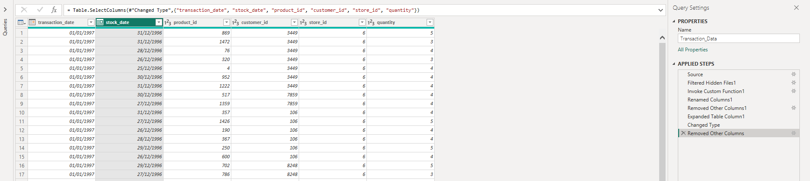

**9. With the exception of the two data tables, disable "Include in Report Refresh", then Close & Apply by:**

- Confirming that all 7 tables are now accessible within both the RELATIONSHIPS view and the DATA view

## Building a Relational Model

There are several steps in this phase in order to build a Relational Model.

**1. In the MODEL view, arrange your tables with the lookup tables above the data tables by:**

- Connecting Transaction_Data to Customers, Products, and Stores using valid primary/foreign keys 
- Connecting Transaction_Data to Calendar using both date fields, with an inactive "stock_date" relationship
- Connecting Return_Data to Products, Calendar, and Stores using valid primary/foreign keys
- Connecting Stores to Regions as a "snowflake" schema

**2. Confirm the following:**

- All relationships follow one-to-many cardinality, with primary keys (1) on the lookup side and foreign keys (*) on the data side
- Filters are all one-way (no two-way filters)
- Filter context flows "downstream" from lookup tables to data tables
- Data tables are connected via shared lookup tables (not directly to each other)

**3. Hide all foreign keys in both data tables from Report View, as well as "region_id" from the Stores table**

**4. In the DATA view, complete the following steps by:**
- Updating all date fields (across all tables) to the "M/d/yyyy" format using the formatting tools in the Modeling tab
- Updating "product_retail_price", "product_cost", and "discount_price" to Currency ($ English) format
- In the Customers table, categorizing "customer_city" as City, "customer_postal_code" as Postal Code, and "customer_country" as Country/Region
- In the Stores table, categorizing "store_city" as City, "store_state" as State or Province, "store_country" as Country/Region, and "full_address" as Address 

The Steps above results in the following Relation Model:

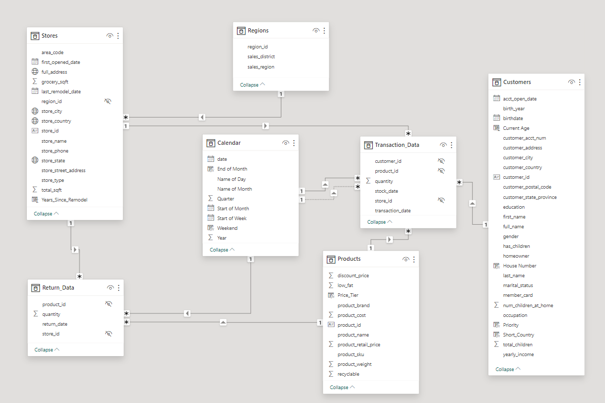

## Adding Calculated Fields and DAX (Data Analysis eXpression)
There are 2 spots in which I worked to add Calculation Fields and DAX, i.e. the **Data View** and the **Report View**.

**1. In the DATA view, add the following calculated columns by:**

- Adding a column in the Calendar table, named "Weekend", which equals "Y" for Saturdays or Sundays (otherwise "N")
```Sh
Weekend = 
if('Calendar'[Name of Day] IN {"Saturday","Sunday"},"Y","N")
```
- Adding a column in the Calendar table, named "End of Month", that returns the last date of the current month for each row
```Sh
End of Month = EOMONTH('Calendar'[date],0)
```
- Adding a column in the Customers table, named "Current Age" that calculates current customer ages using the "birthdate" column and the TODAY() function
```Sh
Current Age = DATEDIFF(Customers[birthdate], TODAY(), YEAR)
```
- Adding a column in the Customers table, named "Priority" which equals "High" for customers who own homes and have Golden membership cards (otherwise "Standard")
```Sh
Priority = IF(Customers[homeowner]="Y" && Customers[member_card]="Golden","High","Standard")
```
- Adding a column in the Customers table, named "Short_Country" that returns the first three characters of the customer country, and converts to all uppercase
```Sh
Short_Country = UPPER(LEFT(Customers[customer_country],3))
```
- Adding a column in the Customers table, named "House Number" that extracts all characters/numbers before the first space in the "customer_address" column (hint: use SEARCH)
```Sh
House Number = LEFT(Customers[customer_address],SEARCH(" ",Customers[customer_address])-1)
```
- Adding a column in the Products table, named "Price_Tier" that equals "High" if the retail price is >$3, "Mid" if the retail price is >$1, and "Low" otherwise
```Sh
Price_Tier = SWITCH(TRUE(),Products[product_retail_price]>3,"High",Products[product_retail_price]>1,"Mid","Low")
```
- Adding a column in the Stores table, named "Years_Since_Remodel" that calculates the number of years between the current date (TODAY()) and the last remodel date
```Sh
Years_Since_Remodel = DATEDIFF(Stores[last_remodel_date],TODAY(),YEAR)
```

**2. In the REPORT view, add the following measures (Assign to tables as you see fit, and use a matrix to match the "spot check" values) by:**

- Creating new measures named "Quantity Sold" and "Quantity Returned" to calculate the sum of quantity from each data table, and conducting Spot check to see total Quantity Sold = 833,489 and total Quantity Returned = 8,289
```Sh
Quantity Sold = SUM(Transaction_Data[quantity])
Quantity Returned = SUM(Return_Data[quantity])
```
- Creating new measures named "Total Transactions" and "Total Returns" to calculate the count of rows from each data table, and conducting Spot check to see 269,720 transactions and 7,087 returns
```Sh
Total Transaction = COUNTROWS(Transaction_Data)
Total Return = COUNT(Return_Data[return_date])
```
- Creating a new measure named "Return Rate" to calculate the ratio of quantity returned to quantity sold (format as %), and conducting Spot check to see an overall return rate of 0.99%
```Sh
Return Rate = DIVIDE([Quantity Returned],[Quantity Sold])
```
- Creating a new measure named "Weekend Transactions" to calculate transactions on weekends, and conducting Spot check to see 76,608 total weekend transactions
```Sh
Weekend Transaction = CALCULATE([Total Transaction],'Calendar'[Weekend]="Y")
```
- Creating a new measure named "% Weekend Transactions" to calculate weekend transactions as a percentage of total transactions (format as %), and conducting Spot check to see 28.4% weekend transactions
```Sh
% Weekend Transaction = DIVIDE([Weekend Transaction],[Total Transaction])
```
- Creating new measures named "All Transactions" and "All Returns" to calculate grand total transactions and returns (regardless of filter context), and conducting Spot check to see 269,720 transactions and 7,087 returns across all rows
```Sh
All Transaction = CALCULATE([Total Transaction],ALL(Transaction_Data))
All Return = CALCULATE([Total Return],ALL(Return_Data))
```
- Creating a new measure to calculate "Total Revenue" based on transaction quantity and product retail price, and formating as $ (using and iterator), as well as conducting pot check to see a total revenue of $1,764,546
```Sh
Total Revenue = SUMX(Transaction_Data,Transaction_Data[quantity]*RELATED(Products[product_retail_price]))
```
- Creating a new measure to calculate "Total Cost" based on transaction quantity and product cost, and formating as $ (using an iterator), as well as conducting Spot check to see a total cost of $711,728
```Sh
Total Cost = SUMX(Transaction_Data,Transaction_Data[quantity]*RELATED(Products[product_cost]))
```
- Creating a new measure named "Total Profit" to calculate total revenue minus total cost, formating as $, and conducting Spot check to see a total profit of $1,052,819
```Sh
Total Profit = [Total Revenue]-[Total Cost]
```
- Creating a new measure to calculate "Profit Margin" by dividing total profit by total revenue calculate total revenue (format as %), and conducting Spot check to see an overall profit margin of 59.67%
```Sh
Profit Margin = DIVIDE([Total Profit],[Total Revenue])
```
- Creating a new measure named "Unique Products" to calculate the number of unique product names in the Products table, and conducting Spot check to see 1,560 unique products
```Sh
Unique Products = DISTINCTCOUNT(Products[product_name])
```
- Creating a new measure named "YTD Revenue" to calculate year-to-date total revenue, formating as $, and createing a matrix with "Start of Month" on rows to see $872,924 in YTD Revenue in September 1998 for Spot check
```Sh
YTD Revenue = CALCULATE([Total Revenue],DATESYTD('Calendar'[date]))
```
- Creating a new measure named "60-Day Rolling Revenue" to calculate a running revenue total over a 60-day period, formating as $, and creating a matrix with "date" on rows to see $97,570 in 60-Day Revenue on 4/14/1997 for Spot check
```Sh
60-Day-Rolling Revenue = CALCULATE([Total Revenue],DATESINPERIOD ('Calendar'[Date],MAX('Calendar'[Date]),-60,DAY))
```
- Creating new measures named  "Last Month Transactions", "Last Month Revenue", "Last Month Profit", and "Last Month Returns", and creating a matrix with "Start of Month" on rows to confirm accuracy for Spot check
```Sh
Last Month Transaction = CALCULATE([Total Transaction],DATEADD('Calendar'[date],-1,MONTH))
Last Month Revenue = CALCULATE([Total Revenue],DATEADD('Calendar'[Date],-1,MONTH))
Last Month Profit = CALCULATE([Total Profit],DATEADD('Calendar'[Date],-1,MONTH))
Last Month Returns = CALCULATE([Total Return],DATEADD('Calendar'[Date],-1,MONTH))
```
- Creating a new measure named "Revenue Target" based on a 5% lift over the previous month revenue, and formating as $, and conducting Spot check to see a Revenue Target of $99,223 in March 1998
```Sh
Revenue Target = [Last Month Revenue]*1.05
```

Executing the Two detailed Steps above, resulted in adding a new Table containing all Measures needed in the modelling.

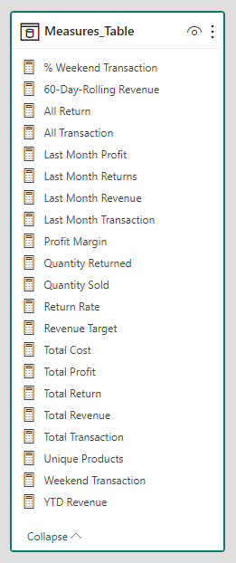

The overall tables created the complete Realtion Model for all the data loaded in the Power Bi

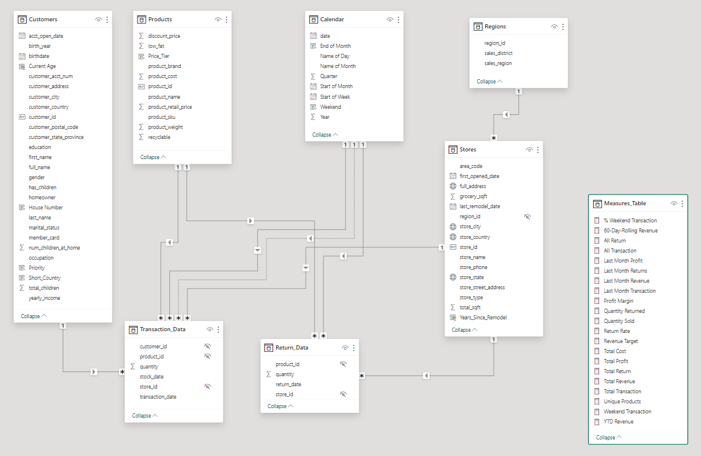

## Building Interactive Report

## Analysis to answer the Problem Questions
